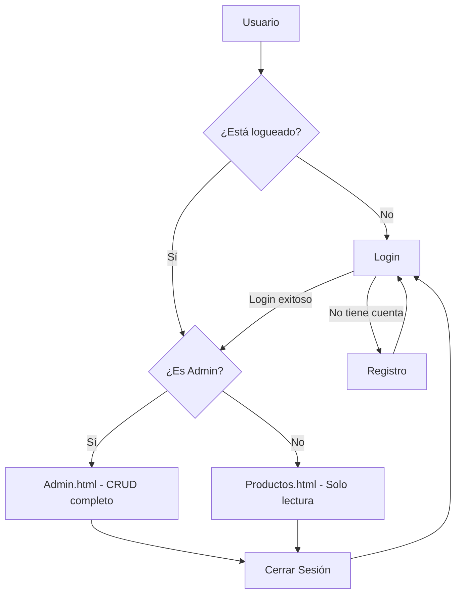

# 📦 Tienda Tech - Sistema de Gestión de Productos con Login

## 📋 Descripción

**Tienda Tech** es una aplicación web **demostrativa** que implementa un sistema de autenticación con registro de usuarios, login y un CRUD completo de productos con separación de roles. Este proyecto ha sido desarrollado **exclusivamente con fines educativos** para demostrar conceptos básicos de desarrollo web.

### 🎯 Propósito Educativo
- Aprender los fundamentos de **HTML, CSS y JavaScript**
- Entender el concepto de **CRUD** en aplicaciones web
- Implementar un **sistema de autenticación básico**
- Practicar la **manipulación del DOM**
- Conocer el uso de **LocalStorage** para persistencia de datos
- Comprender la **separación de roles** (Admin/Usuario)

---

> ⚠️ **PROYECTO DEMOSTRATIVO - SOLO PARA FINES EDUCATIVOS**  
> Este proyecto es un ejemplo de aprendizaje y **NO debe ser utilizado en entornos de producción**.  
> Las contraseñas se almacenan en texto plano y no hay medidas de seguridad reales.

---

### ⚠️ Limitaciones del Proyecto
| Aspecto | Estado | Explicación |
|---------|--------|-------------|
| **Seguridad** | ❌ Inseguro | Contraseñas en texto plano |
| **Autenticación** | ❌ Básica | Sin encriptación ni tokens |
| **Base de Datos** | ❌ No existe | Usa LocalStorage del navegador |
| **Servidor** | ❌ No tiene | Todo se ejecuta en el cliente |
| **Validación** | ⚠️ Mínima | Solo validación en frontend |
| **Escalabilidad** | ❌ No | No apto para múltiples usuarios |

---

## 🛠️ Tecnologías Utilizadas


| Tecnología | Uso | Nota |
|------------|-----|------|
| **HTML5** | Estructura de las páginas | Semántica básica |
| **CSS3** | Estilos minimalistas | Diseño responsive básico |
| **JavaScript ES6+** | Lógica de la aplicación | Código para demostración |
| **LocalStorage** | Almacenamiento | Persistencia en navegador |

---

## 📁 Estructura del Proyecto

```
tienda-tech/
│
├── 📄 index.html           # Página de login
├── 📄 register.html        # Página de registro de usuarios
├── 📄 productos.html       # Vista de usuario (solo lectura)
├── 📄 admin.html          # Vista de administrador (CRUD completo)
├── 📄 detalle.html        # Página de detalle del producto
├── 🎨 style.css           # Estilos minimalistas
├── 📜 login.js            # Lógica de autenticación
├── 📜 productos.js        # Lógica de usuario (solo lectura)
├── 📜 admin.js           # Lógica de administrador (CRUD completo)
├── 📁 img/               # Carpeta de imágenes de ejemplo
│   ├── 🖼️ notebook.jpg
│   ├── 🖼️ mouse.jpg
│   └── 🖼️ teclado.jpg
└── 📄 README.md          # Documentación del proyecto
```

---

## 🎯 Funcionalidades (Demostrativas)

### 🔐 Sistema de Autenticación (Básico)

| Función | Descripción | Limitación |
|---------|-------------|------------|
| **Login** | Inicio de sesión | Contraseñas en texto plano |
| **Registro** | Creación de cuentas | Sin validación real de email |
| **Logout** | Cierre de sesión | Solo elimina la sesión del navegador |
| **Protección** | Rutas protegidas | Solo redirección en frontend |

### 👑 Roles y Permisos (Simulados)

| Acción | 👤 Usuario | 👑 Admin |
|--------|-----------|----------|
| Ver productos | ✅ | ✅ |
| Ver detalles | ✅ | ✅ |
| Registrar usuario | ✅ | ✅ |
| Agregar productos | ❌ | ✅ |
| Editar productos | ❌ | ✅ |
| Eliminar productos | ❌ | ✅ |

### 📦 Gestión de Productos (Demostrativa)

| Operación | Descripción | Persistencia |
|-----------|-------------|--------------|
| **➕ Crear** | Agregar productos | LocalStorage |
| **👁️ Leer** | Visualizar productos | LocalStorage |
| **✏️ Actualizar** | Editar productos | LocalStorage |
| **🗑️ Eliminar** | Eliminar productos | LocalStorage |

---

## 💾 Persistencia de Datos (LocalStorage)

### Estructura de Usuario (Ejemplo)
```javascript
{
    id: 1,
    username: "admin",
    password: "admin123", // ⚠️ Texto plano - INSECURO
    fullname: "Administrador",
    email: "admin@tienda.com",
    role: "admin",
    createdAt: "2024-01-01T00:00:00.000Z"
}
```

### Estructura de Producto (Ejemplo)
```javascript
{
    id: 1,
    nombre: "Notebook",
    precio: 500000,
    descripcion: "Notebook para estudio y trabajo",
    imagen: "img/notebook.jpg"
}
```

---

## 🔐 Credenciales de Demo

| Rol | Usuario | Contraseña | Nota |
|-----|---------|------------|------|
| 👑 Admin | `admin` | `admin123` | Usuario predefinido |
| 👤 Usuario | `usuario` | `user123` | Usuario predefinido |

> 💡 **Nuevos usuarios**: Puedes registrarte, pero **todos los datos se almacenan en LocalStorage** y se pierden al limpiar el navegador.

---

## ⚠️ ADVERTENCIAS DE SEGURIDAD

Este proyecto **NO ES SEGURO** y **NO DEBE USARSE EN PRODUCCIÓN** debido a:

1. ❌ **Contraseñas en texto plano** - Sin encriptación (no usa bcrypt, hash, etc.)
2. ❌ **Sin autenticación real** - No hay servidor, todo es frontend
3. ❌ **Sin HTTPS** - No hay comunicación segura
4. ❌ **Sin validación en servidor** - Todo se valida en el cliente
5. ❌ **Datos visibles** - Cualquiera puede ver el LocalStorage
6. ❌ **Sin protección CSRF/XSS** - Vulnerable a ataques
7. ❌ **Sin límite de intentos** - Vulnerable a ataques de fuerza bruta
8. ❌ **Sin recuperación de contraseña** - No implementada

### 🚨 En un proyecto real DEBES implementar:
- ✅ **Backend** con Node.js, Python, PHP, etc.
- ✅ **Base de datos** (MySQL, PostgreSQL, MongoDB)
- ✅ **Encriptación** de contraseñas (bcrypt, Argon2)
- ✅ **JWT** o sesiones seguras con cookies
- ✅ **HTTPS** con certificado SSL
- ✅ **Validación** en servidor y cliente
- ✅ **Rate limiting** para prevenir ataques
- ✅ **Logs** de seguridad
- ✅ **Middleware** de autenticación

---

## 🚀 Instalación y Ejecución (Local)

### Opción 1: VS Code con Live Server (Recomendado)
```bash
1. Clona el repositorio
   git clone https://github.com/tu-usuario/tienda-tech.git

2. Abre la carpeta en VS Code
   cd tienda-tech
   code .

3. Instala la extensión "Live Server"

4. Haz clic derecho en index.html → "Open with Live Server"
```

### Opción 2: Python HTTP Server
```bash
# Python 3
python -m http.server 8000

# Abre en navegador: http://localhost:8000
```

### Opción 3: Node.js
```bash
# Instalar serve globalmente
npm install -g serve

# Ejecutar en la carpeta del proyecto
serve

# Abre en navegador: http://localhost:3000
```

---

## 🔄 Flujo de la Aplicación (Demostrativo)



---

## 🎨 Diseño (Minimalista)

### Paleta de Colores
- **Principal**: `#2563eb` (Azul)
- **Fondo**: `#f8fafc` (Gris claro)
- **Tarjetas**: `#ffffff` (Blanco)
- **Texto**: `#0f172a` (Azul oscuro)

### Características
- ✅ Diseño limpio y minimalista
- ✅ Tarjetas con sombras sutiles
- ✅ Efectos hover suaves
- ✅ Totalmente responsive
- ✅ Footer informativo

---

## 🎓 Conceptos Abordados (Educativos)

| Concepto | Implementación |
|----------|---------------|
| Autenticación básica | Sistema de login con roles |
| Registro de usuarios | Formulario con validación |
| CRUD | Crear, Leer, Actualizar, Eliminar |
| LocalStorage | Persistencia de datos en navegador |
| Manipulación del DOM | `getElementById`, `innerHTML` |
| Eventos | `addEventListener`, `onclick` |
| Métodos de Array | `map`, `filter`, `find`, `reduce` |
| JSON | `parse`, `stringify` |
| CSS Grid y Flexbox | Layout responsive |
| Funciones | Declaración, parámetros, retorno |
| Formularios | Validación básica |
| Modales | Apertura/cierre con CSS y JS |
| Protección de rutas | Redirección por roles |

---

## 📊 Estado del Proyecto

| Aspecto | Estado |
|---------|--------|
| **Funcionalidad** | ✅ 100% funcional para demostración |
| **Seguridad** | ❌ Inseguro - Solo educativo |
| **Escalabilidad** | ❌ No escalable |
| **Mantenibilidad** | ⚠️ Básica |
| **Documentación** | ✅ Completa |
| **Código** | ✅ Comentado y organizado |
| **Responsive** | ✅ Sí |

---

## 📌 Disclaimer

**Este proyecto es exclusivamente educativo y demostrativo.**

- No debe ser utilizado en entornos de producción
- No cumple con estándares de seguridad
- No almacena datos de forma segura
- No utiliza encriptación
- No tiene autenticación real

El propósito es **comprender conceptos básicos** de desarrollo web y **demostrar** cómo funcionan las aplicaciones con autenticación en el lado del cliente y el uso de LocalStorage.

## Nota:
> _Se utilizó asistencia de Inteligencia Artificial (DeepSeek) para apoyar en la redacción y estructuración del texto junto con los diseños aplicados al sistema._

